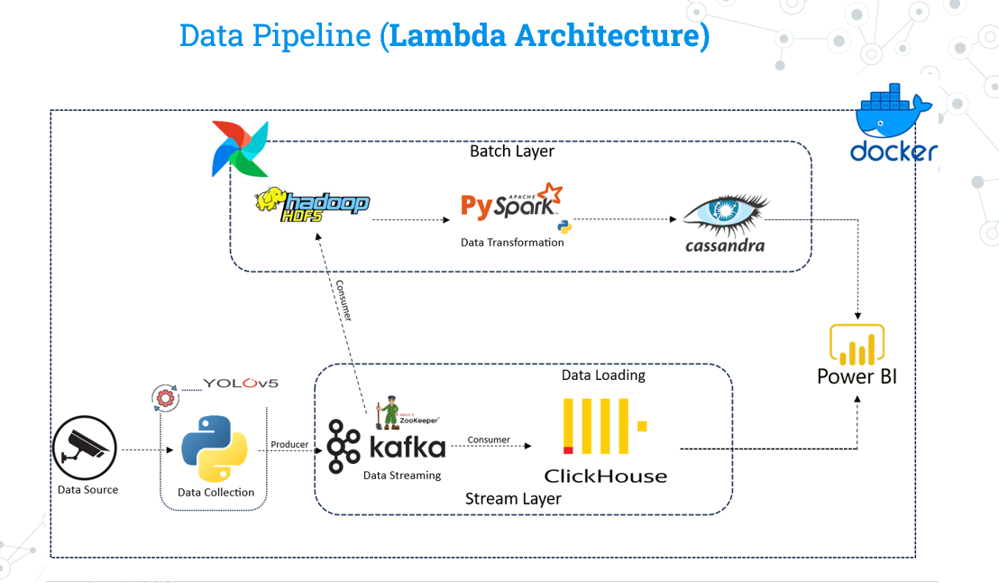

# Real Time People Monitoring - Lambda Architecture


<p align="center">
    <figure>
        
        <figcaption align="center"><b>Figure 1:</b> Project Architecture Diagram</figcaption>
    </figure>
</p>


This project implements a real-time data pipeline using the Lambda Architecture. It is designed to monitor people in real-time through video data, leveraging both batch and stream processing layers to handle and visualize the data effectively.

## Architecture Overview

The Lambda Architecture divides the data processing into two main layers:

1. **Batch Layer:** Handles large volumes of historical data, allowing for complex transformations and data storage.
2. **Stream Layer:** Processes data in real-time for instant insights.

### Components

* **Data Source:** Video feed input to collect real-time monitoring data.
* **YOLOv5:** Used for object detection to identify people in the video frames.
* **Apache Kafka:** A distributed streaming platform where YOLOv5 outputs data as a producer, and Kafka acts as the main message broker for data ingestion.
* **Batch Layer Pipeline (Kafka Consumer):**
  * **HDFS (Hadoop Distributed File System):** Stores raw data consumed from Kafka.
  * **PySpark:** Processes and transforms data from HDFS.
  * **Cassandra:** Stores the transformed data for efficient retrieval.
* **Stream Layer Pipeline:**
  * **ClickHouse:** Consumes raw data directly from Kafka, enabling low-latency real-time data analysis.
* **Power BI:** Used as the visualization tool for data from both the Batch and Stream layers.

### Workflow

1. **Data Collection:**
   * Video input is processed by **YOLOv5** to detect people.
   * Processed data is produced to  **Kafka** .
2. **Batch Processing:**
   * **Kafka Consumer** ingests data into **HDFS** for storage.
   * **PySpark** performs data transformation and stores processed data in  **Cassandra** .
   * **Power BI** is used to visualize insights derived from the batch layer.
3. **Stream Processing:**
   * **ClickHouse** consumes raw data directly from  **Kafka** .
   * Real-time data insights are visualized using  **Power BI** .

### Docker Integration

This pipeline is containerized with **Docker** for easy deployment and scalability across different environments.

## Getting Started

To run the project, ensure Docker and Docker Compose are installed on your machine. Then, clone the repository and start the services:

```bash
git clone
cd Real-Time-People-Monitoring-BigData-Lambda-Architecture
docker-compose up -d
```

## Visualizations

Data insights can be visualized on  **Power BI** , which fetches data from both the batch layer (Cassandra) and the stream layer (ClickHouse).

### Power BI Connectors

We need to add the following connectors to the folder "Power BI Desktop/Custom Connectors"

* **Cassandra Connector** : Enables Power BI to retrieve data from Cassandra for batch layer visualization. [Learn more about the Cassandra Connector here](https://www.cdata.com/drivers/cassandra/powerbi/).
* **ClickHouse Connector** : Integrates Power BI with ClickHouse for real-time data visualization. [Learn more about the ClickHouse Connector here](https://clickhouse.com/docs/en/integrations/powerbi).

## Technologies Used

* **YOLOv5** - Object detection
* **Apache Kafka** - Data streaming platform
* **Apache Hadoop (HDFS)** - Data storage for batch processing
* **Apache PySpark** - Data transformation
* **Apache Cassandra** - Data storage for transformed data
* **ClickHouse** - Real-time data storage and analysis
* **Power BI** - Visualization tool
* **Docker** - Containerization for deployment

## Future Enhancements

* Add more advanced analytics for detecting specific behaviors or anomalies.
* Integrate alert systems for real-time monitoring notifications.
* Optimize the PySpark transformations for better performance in the batch layer
